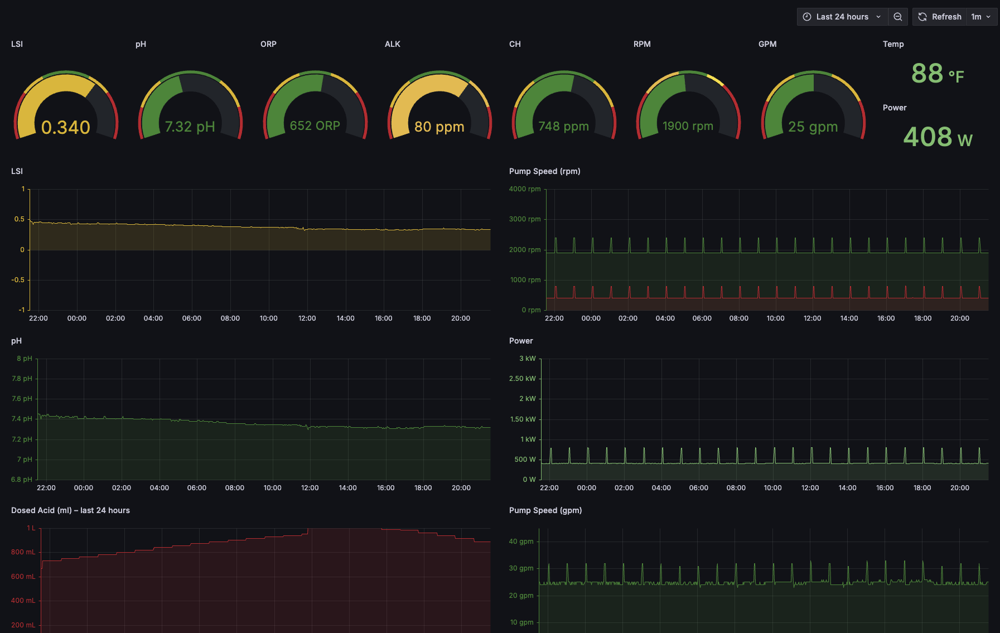

# nodejs-poolController-prometheus-exporter
Prometheus Exporter for [nodejs-poolController](https://github.com/tagyoureit/nodejs-poolController?tab=readme-ov-file)  
- runs on port 9101
- should be run on same host as nodejs-poolController
- connects to http://localhost:4200/state/all to pull metrics

## Exports metrics from chemController[0]:
- ph
- dosed_acid
- orp
- alk
- ch 
- lsi 
- temp (Pool) 


## Export metrics from pumps[0]:
- rpm 
- gpm (gallons per minute)
- watts (Pump)

Allows creation of Grafana dashboards like the following.


# How to Install
## Step 1 - Clone Project
```
git clone https://github.com/ibehren1/nodejs-poolController-prometheus-exporter.git
```


## Step 2 - Install Pre-requisites (OS level)
- make
- python3
- python3-pip
- python3-venv


## Step 3 - Install njspc-exporter
```
sudo make install
```


## To Check status
```
make status

or

systemctl status njspc-exporter
```


## To Uninstall
```
sudo make uninstall
```


Copyright © 2025 Isaac Behrens. All rights reserved.